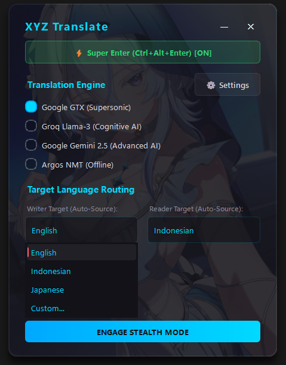

#  xyz translate

> a zero-lag, system-wide advanced easy translation overlay with deep hardware integration, offline support, and weabooo ui.

  

## core features
* **system-wide hardware hooks:** intercepts low-level keyboard and mouse inputs, allowing you to translate text anywhere (browsers, games, chat apps) without switching windows.
* **multi-engine routing:** seamlessly switch between google gtx (supersonic), groq llama-3 (cognitive), google gemini 2.5 (advanced), or argos nmt (strictly offline).
* **ghost reader overlay:** a non-intrusive, transient glass hud that floats over your screen to display translated text, then fades away naturally.
* **direct hardware injection (writer):** automatically pastes translated text directly into your active input field using safe, low-level clipboard overrides.
* **super enter (smart translation):** type your native language, press `ctrl+alt+enter`, and the system will automatically backspace your original text, translate it, and inject the result.
* **the enforcer & humanizer:** advanced text processing that enforces source punctuation (..., ?, !) and features a "slang mode" to lowercase and naturalize output.
* **argos offline model manager:** download and manage nmt language models directly within the ui for 100% offline, privacy-focused translation.
* **zero-lag memory cache:** built-in sqlite database (`memory.db`) instantly serves previously translated phrases, saving api calls and time.

## advanced features
* for groq, gemini api.. you can customize the output writer as you wish, for example making it slang or japanese romaji. by changing custom to (eg: english slang, japanese romaji, russian romaji) 

## glickko notes 
* i made this for myself.. because there is no application of this model in this world (i just imagine then do it) , and i really like memorizing by typing. learning a language is really fun when you really commit it to muscle memory 
* ahh i think you need to use googlegtx fast and i dont know what the limit is, this is just like google translate << i recom this so very fast, better grammar
* and yeah groq is high limit request, just generate api with different email. seperate by commas, and it will saved in config. every time you get limit api key, my logic will auto using another key << i recom this so fast
* argos is offline, but very slow  << better dont use this one, use when you really dont have internet connection  

## how to use

the workflow is designed to be invisible and frictionless:

1.  **launch & configure:** run the executable. open the `settings` gear to add your groq/gemini api keys, or use the `model manager` to download offline argos models. set your native language.
2.  **ghost reader (`alt+q`):** highlight any foreign text on your screen, press `alt+q`. the ghost reader panel will instantly appear with the translation, then fade away.
3.  **hardware writer (`alt+w`):** highlight text you want to reply to, press `alt+w`. xyz translate translates it into the target language and injects it straight into your active text box.
4.  **engage super enter (`ctrl+alt+enter`):** enable the "super enter" toggle in the main ui. type your message in your native language inside any app, hit `ctrl+alt+enter`, and watch it instantly swap to the translated version.
5.  **stealth mode:** click "engage stealth mode" to hide the ui. it will sit quietly in your system tray, ready for your hotkeys.

### where your files are stored

this application strictly follows the fcportable zero-bloat architecture. everything remains alongside the executable:

* **`_internal/`**: contains the python/argos nmt bridge and core runtime engine.
* **`app/`**: holds all user-modifiable assets (e.g., `icon.ico`, `background.png`). 
* **`data/`**: auto-created on first run. stores your `config.ini`, sqlite memory cache (`memory.db`), crash logs, and downloaded offline translation models.

you can move the entire folder anywhere on your pc or to a usb drive, and it will run exactly as you left it.

## deficiencies & limitations

while highly capable, the app's aggressive system integration comes with a few known limitations:

* **windows exclusive:** heavily relies on the win32 api and directx/dwm for its glassmorphic ui and hardware hooks. it will not work on macos or linux.
* **anti-cheat false positives:** because it uses low-level keyboard and mouse hooks (`wh_keyboard_ll`, `wh_mouse_ll`) to read your inputs globally, aggressive anti-cheat systems in competitive multiplayer games might flag it. 
* **clipboard dependency:** the writer and reader features simulate `ctrl+c` and `ctrl+v` to extract and inject text. this might briefly interfere with your clipboard history or fail in applications that strictly block synthetic paste commands (like some secure terminals).
* **super enter desyncs:** the "super enter" feature tracks your keystrokes in a background buffer. if you click away mid-sentence or use arrow keys extensively before pressing `ctrl+alt+enter`, the automated backspacing might delete the wrong amount of text.
* **bring your own keys (byok):** the advanced ai engines (groq and gemini) do not come with pre-loaded access; you must generate and provide your own free api keys in the settings menu.
* **another is i compiled this using mingw, i dont know if its safe on your windows. but i included the source code, i hope if this can help you to upgrade the application, i really hope 

